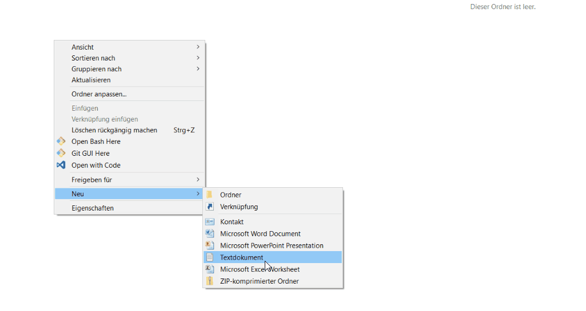
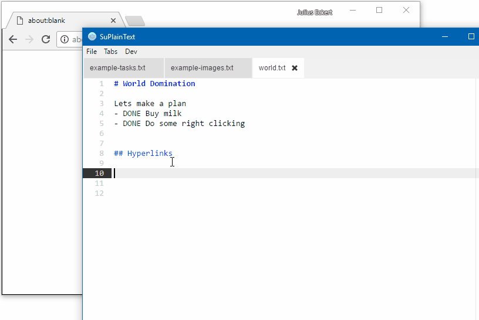
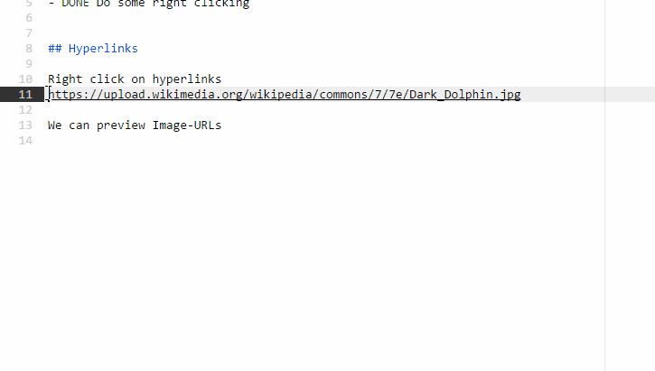
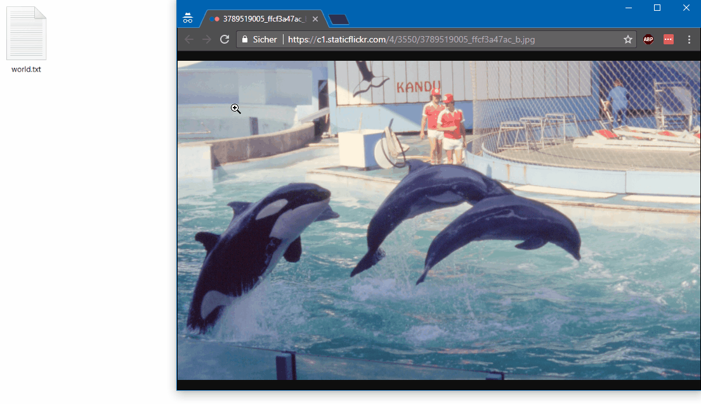

# Beaver Text - Supercharged Plain Text Notes

 

Notes App for **Plain Text Files**
- **No Lock-In:** Edit your notes with any text-editor.
- **Sync your way:** Sync your notes with Dropbox, GDrive, git...
- **Hyperlinks:** Right click on hyperlinks to open them in your browser.
- **Headlines:** Structure your notes with headlines (put # at line beginning).
- **Task Management:** Right click the word `TODO` to change it to `DONE`.
- **Images:** Image-URLs can be previewed inline.
- **Images:** Paste your image (eg. Screenshot) into the note (image file gets saved automatically into a folder next to your text file)

**[Download the latest Release](https://github.com/julius/SuPlainText/releases/)**

## Demo Task-Management

## Demo Hyperlinks

## Demo Images

## Demo Copy&Paste Images

## Tech Details
This is build using
- Electron
- Ace (HTML5 Text-Editor)
- CropperJS (Image Cropping)
- Bootstrap+jQuery

## Icon Attribution
Logo-Icon made by [Freepik](http://www.freepik.com) from [www.flaticon.com](https://www.flaticon.com/) is licensed by [CC 3.0 BY](http://creativecommons.org/licenses/by/3.0/)
